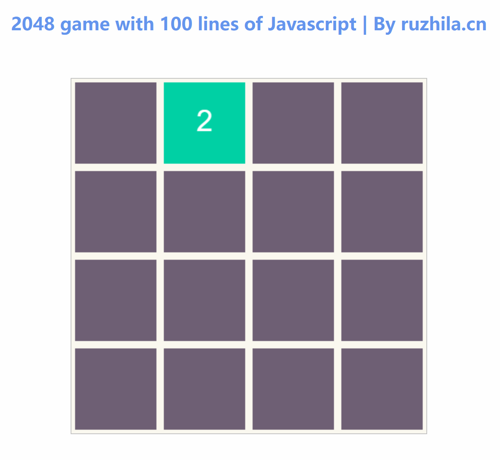

# A game with 100 lines of Javascript, 100 lines javascript code

By [ruzhila.cn](http://ruzhila.cn/?from=github_2048), a campus for learning backend development through practice.

### 🚀 [100-line-code](https://github.com/ruzhila/100-line-code)  A collection of learning projects written in 100 lines of code 

This is a tutorial code demonstrating how to use Javascript write game. Pull requests are welcome. 👏

## Usage
Open `index.html` in your browser. Enjoy the game!
